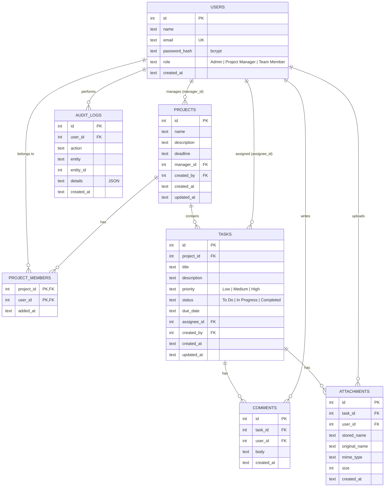

# ER Diagram

Rendered automatically by GitHub (Mermaid). Or paste into https://mermaid.live.

```mermaid
erDiagram
    USERS ||--o{ PROJECTS : "manages (manager_id)"
    USERS ||--o{ PROJECT_MEMBERS : "belongs to"
    PROJECTS ||--o{ PROJECT_MEMBERS : "has"
    PROJECTS ||--o{ TASKS : "contains"
    USERS ||--o{ TASKS : "assigned (assignee_id)"
    TASKS ||--o{ COMMENTS : "has"
    USERS ||--o{ COMMENTS : "writes"
    TASKS ||--o{ ATTACHMENTS : "has"
    USERS ||--o{ ATTACHMENTS : "uploads"
    USERS ||--o{ AUDIT_LOGS : "performs"

    USERS {
        int id PK
        text name
        text email UK
        text password_hash "bcrypt"
        text role "Admin | Project Manager | Team Member"
        text created_at
    }
    PROJECTS {
        int id PK
        text name
        text description
        text deadline
        int manager_id FK
        int created_by FK
        text created_at
        text updated_at
    }
    PROJECT_MEMBERS {
        int project_id PK,FK
        int user_id PK,FK
        text added_at
    }
    TASKS {
        int id PK
        int project_id FK
        text title
        text description
        text priority "Low | Medium | High"
        text status "To Do | In Progress | Completed"
        text due_date
        int assignee_id FK
        int created_by FK
        text created_at
        text updated_at
    }
    COMMENTS {
        int id PK
        int task_id FK
        int user_id FK
        text body
        text created_at
    }
    ATTACHMENTS {
        int id PK
        int task_id FK
        int user_id FK
        text stored_name
        text original_name
        text mime_type
        int size
        text created_at
    }
    AUDIT_LOGS {
        int id PK
        int user_id FK
        text action
        text entity
        int entity_id
        text details "JSON"
        text created_at
    }
```
